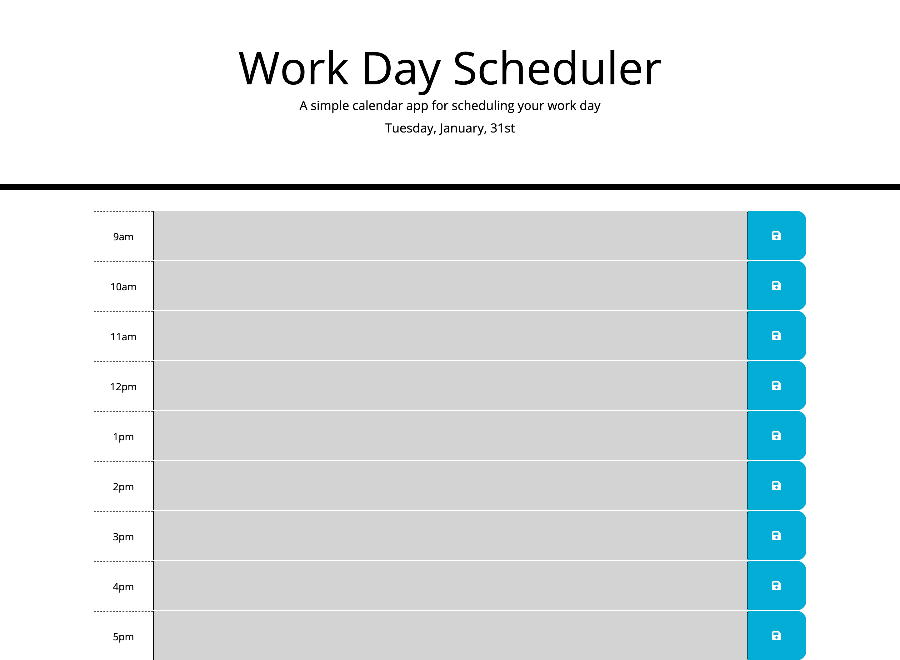
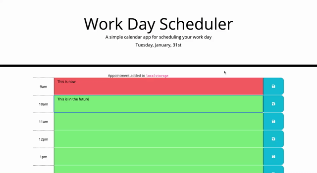

# daily-planner-app
Deployed link: https://beazach.github.io/daily-planner-app/

## Description 
In this project I was tasked with creating a simple calendar application that allows a user to save events for each hour of the day.

### Acceptance Criteria
Display the current day at the top of the calendar when a user opens the planner.

Present timeblocks for standard business hours when the user scrolls down.

Color-code each timeblock based on past, present, and future when the timeblock is viewed.

Allow a user to enter an event when they click a timeblock.

Save the event in local storage when the save button is clicked in that timeblock.

Persist events between refreshes of a page.

## Usage
Application appearance:

Screen
The following animation demonstrates the application funcitonality:

Link:
https://drive.google.com/file/d/1lhbpqDqb7sP53oKgl3IByN_n4u99def8/preview

## Contact Details
Please leave a note or get in touch about suggestions for code improvements, future projects and collaborations.

## License 
MIT

## Resources 
- https://courses.bootcampspot.com/courses/3029/ (accessed 30 January 2023)
- https://fantastic-pudding.vercel.app/ (accessed 30 January 2023)
